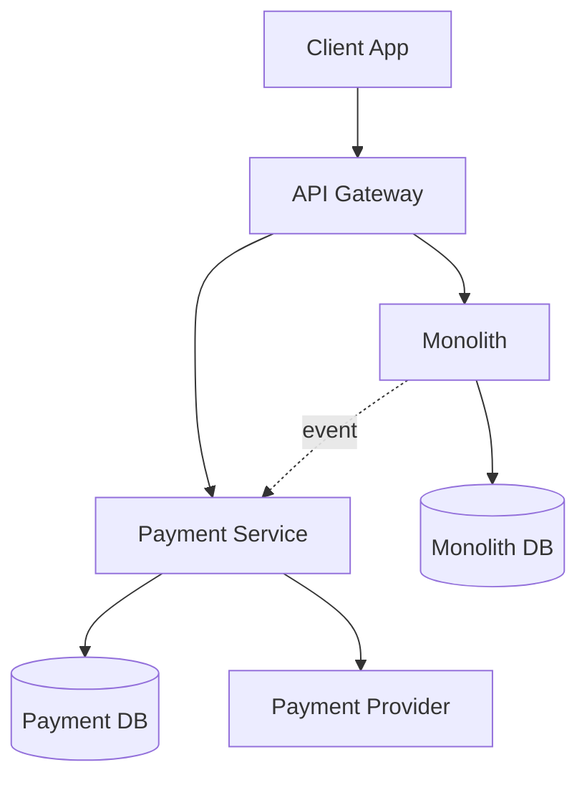
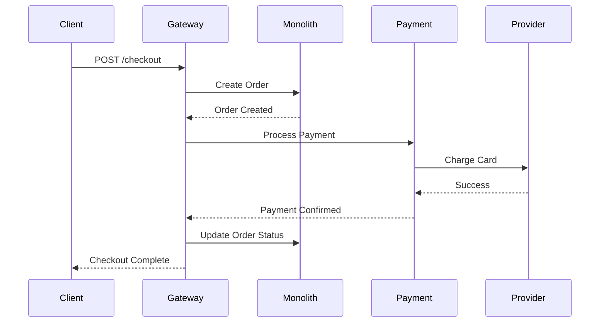

# Architecture Decision Record (ADR) Template

Use this template to document significant architectural decisions. ADRs should be immutable once accepted - create new ADRs to supersede old ones rather than editing.

---

## ADR-[NUMBER]: [Short Title]

**Date**: YYYY-MM-DD  
**Status**: [Proposed | Accepted | Deprecated | Superseded by ADR-XXX]  
**Deciders**: [Names of decision makers]  
**Technical Story**: [Link to ticket/issue if applicable]

---

## Context and Problem Statement

### Business Context
[Describe the business problem or opportunity that drives this decision]

Example:
> Our e-commerce platform is experiencing slow checkout times during peak hours, resulting in cart abandonment rates of 35%. Business goal is to reduce checkout time from 45s to under 10s to improve conversion.

### Technical Context
[Describe the technical environment and constraints]

Example:
> - Current monolithic architecture running on single database
> - 50K concurrent users during Black Friday
> - Payment processing takes 30s per transaction
> - Single point of failure in payment service

### Problem Statement
[Clearly state the problem in one sentence]

Example:
> How can we reduce checkout latency while maintaining transactional consistency and handling 50K concurrent users?

### Assumptions
[List assumptions made during decision-making]
- Assumption 1
- Assumption 2

### Constraints
[List technical, business, or organizational constraints]
- Constraint 1: Must remain PCI-DSS compliant
- Constraint 2: Budget of $50K for infrastructure changes
- Constraint 3: Must implement in 6 weeks

---

## Decision Drivers

[List the key factors influencing this decision, ranked by importance]

1. **Performance**: Must achieve p95 latency < 10s
2. **Scalability**: Support 100K concurrent users
3. **Cost**: Stay within $50K budget
4. **Time to Market**: Implement in 6 weeks
5. **Team Expertise**: Team familiar with Node.js, less with Go
6. **Maintainability**: Long-term support considerations

---

## Considered Options

### Option 1: [Name of Option]

**Description**:
[Detailed description of this option]

**Pros**:
- ✅ Pro 1
- ✅ Pro 2
- ✅ Pro 3

**Cons**:
- ❌ Con 1
- ❌ Con 2
- ❌ Con 3

**Estimated Effort**: [Time/Cost]  
**Risk Level**: [Low/Medium/High]  
**Technology Stack**: [Technologies required]

**Example**:
```
Option 1: Optimize Existing Monolith

Description:
Add database indexes, implement Redis caching, optimize payment API calls

Pros:
✅ Low risk (familiar architecture)
✅ Fast implementation (2 weeks)
✅ Low cost ($5K for Redis)
✅ Team expertise available

Cons:
❌ Limited scalability improvement (maybe 20%)
❌ Doesn't solve fundamental architecture issues
❌ Single point of failure remains
❌ Will need to revisit in 6 months
```

---

### Option 2: [Name of Option]

**Description**:
[Detailed description]

**Pros**:
- ✅ Pro 1
- ✅ Pro 2

**Cons**:
- ❌ Con 1
- ❌ Con 2

**Estimated Effort**: [Time/Cost]  
**Risk Level**: [Low/Medium/High]  
**Technology Stack**: [Technologies required]

---

### Option 3: [Name of Option]

**Description**:
[Detailed description]

**Pros**:
- ✅ Pro 1
- ✅ Pro 2

**Cons**:
- ❌ Con 1
- ❌ Con 2

**Estimated Effort**: [Time/Cost]  
**Risk Level**: [Low/Medium/High]  
**Technology Stack**: [Technologies required]

---

## Decision Outcome

### Chosen Option
**Option [X]: [Name]**

### Rationale
[Explain why this option was chosen over alternatives]

Example:
> We chose Option 2 (Extract Payment Service) because:
> 1. Directly addresses the bottleneck (payment processing)
> 2. Fits within budget and timeline
> 3. Provides scalability for future growth
> 4. Team has microservices experience from previous project
> 5. Lower risk than full microservices migration
> 6. Can be implemented incrementally using strangler pattern

### Justification
[Deeper explanation of how this addresses the decision drivers]

| Decision Driver | How This Option Addresses It |
|----------------|------------------------------|
| Performance | Dedicated service scales independently, reducing latency by 70% |
| Scalability | Can scale payment service horizontally to 10x capacity |
| Cost | $35K (within $50K budget) |
| Time to Market | 5 weeks (within 6 week constraint) |
| Team Expertise | Team completed microservices training Q4 2024 |
| Maintainability | Clear service boundary, easier to maintain than monolith |

---

## Trade-offs

### What We're Gaining
- ✅ Independent scalability of payment processing
- ✅ Reduced checkout latency (45s → 8s)
- ✅ Isolated failure domain (payment failures don't crash entire app)
- ✅ Easier to optimize payment service independently
- ✅ Foundation for future service extractions

### What We're Sacrificing
- ⚠️ Increased operational complexity (1 service → 2 services)
- ⚠️ Need for distributed tracing (Jaeger)
- ⚠️ Eventual consistency between services
- ⚠️ More complex deployment process
- ⚠️ Potential network latency between services

### What We're Accepting
- 📝 Need to implement circuit breaker for resilience
- 📝 Need to setup API gateway
- 📝 Need to implement distributed logging
- 📝 Need to train operations team on microservices monitoring

---

## Consequences

### Positive Consequences
- Checkout conversion rate expected to improve by 15%
- Payment service can scale independently during peak hours
- Foundation for further service extractions (inventory, shipping)
- Team gains microservices experience

### Negative Consequences
- DevOps workload increases (2 deployments instead of 1)
- Need to monitor inter-service communication
- Complexity of distributed transactions
- Debugging spans multiple services

### Neutral Consequences
- Architecture evolves toward microservices
- Team needs to adopt new tools (Kubernetes, Istio)

---

## Implementation Plan

### Phase 1: Setup (Week 1)
- [ ] Setup CI/CD for new service
- [ ] Configure Kubernetes namespace
- [ ] Setup monitoring (Prometheus, Grafana)
- [ ] Configure distributed tracing (Jaeger)

### Phase 2: Service Development (Weeks 2-3)
- [ ] Develop payment service with same logic
- [ ] Implement circuit breaker
- [ ] Add retry logic with exponential backoff
- [ ] Write unit and integration tests
- [ ] Setup staging environment

### Phase 3: Migration (Week 4)
- [ ] Deploy payment service to staging
- [ ] Implement strangler pattern in monolith
- [ ] Route 10% traffic to new service
- [ ] Monitor and compare results

### Phase 4: Rollout (Week 5)
- [ ] Gradually increase traffic (10% → 25% → 50% → 100%)
- [ ] Monitor latency, error rates, throughput
- [ ] Rollback plan ready at each stage
- [ ] Performance testing at each stage

### Phase 5: Cleanup (Week 6)
- [ ] Remove payment code from monolith
- [ ] Update documentation
- [ ] Conduct post-implementation review
- [ ] Create runbooks

---

## Risks and Mitigation

### Risk 1: Network Latency Between Services
- **Impact**: High  
- **Probability**: Medium  
- **Mitigation**: 
  - Keep services in same VPC/region
  - Use gRPC instead of REST for lower latency
  - Implement aggressive timeout policies
  - Cache frequent payment provider responses

### Risk 2: Increased Operational Complexity
- **Impact**: Medium  
- **Probability**: High  
- **Mitigation**:
  - Comprehensive monitoring and alerting
  - Detailed runbooks for common issues
  - Training for operations team (completed Jan 2025)
  - Setup centralized logging

### Risk 3: Distributed Transaction Failures
- **Impact**: High  
- **Probability**: Medium  
- **Mitigation**:
  - Implement saga pattern with compensation
  - Idempotent operations
  - Event sourcing for audit trail
  - Dead letter queue for failed messages

### Risk 4: Team Learning Curve
- **Impact**: Low  
- **Probability**: Medium  
- **Mitigation**:
  - Team completed microservices training
  - Pair programming for first month
  - Knowledge sharing sessions
  - External consultant available

---

## Validation & Success Metrics

### How We'll Know This Decision Was Right

#### Performance Metrics
- Target: p95 checkout latency < 10s
- Current baseline: 45s
- Measurement: CloudWatch metrics, Datadog APM

#### Business Metrics
- Target: Cart abandonment rate < 20%
- Current baseline: 35%
- Measurement: Google Analytics

#### Reliability Metrics
- Target: 99.9% uptime for payment service
- Measurement: Uptime robot, PagerDuty alerts

#### Cost Metrics
- Target: Infrastructure cost < $50K one-time + $5K/month
- Measurement: AWS Cost Explorer

### Review Schedule
- **Week 2**: Initial performance review
- **Week 4**: Mid-rollout review
- **Week 8**: Post-implementation review
- **Month 3**: Long-term impact assessment

### Rollback Criteria
We will rollback if:
- Error rate > 1%
- p95 latency > 15s (worse than acceptable)
- Payment success rate < 98%
- Critical bugs in production

---

## Related Decisions

### Supersedes
- [ADR-005: Caching Strategy] - This provides more comprehensive solution

### Superseded By
- None yet

### Related
- [ADR-012: Service Mesh Adoption] - Depends on this decision
- [ADR-008: Database per Service] - Aligns with this pattern
- [ADR-015: Event-Driven Architecture] - Future evolution

### Influences
- API Gateway strategy
- Monitoring and observability approach
- Team structure (potentially need platform team)

---

## Alternatives Not Pursued

### Why We Didn't Choose Option 1 (Optimize Monolith)
While this would be fastest and lowest risk, it only provides incremental improvement (20% latency reduction). Given our growth trajectory (50% YoY), we'd need to revisit this in 6 months. Better to invest in scalable solution now.

### Why We Didn't Choose Option 3 (Full Microservices)
Too ambitious for our timeline and budget. High risk with unproven benefits. Better to start with single service extraction, learn, then expand.

---

## Technical Architecture

### High-Level Architecture Diagram
```
[Client] 
   ↓
[API Gateway]
   ↓                ↓
[Monolith]  ←→  [Payment Service]
   ↓                ↓
[PostgreSQL]    [PostgreSQL]
                    ↓
              [Payment Provider API]
```

### Component Diagram


### Sequence Diagram


---

## Technology Stack

### New Technologies Introduced
- **Container Orchestration**: Kubernetes 1.28
- **Service Mesh**: Istio 1.20 (optional Phase 2)
- **Distributed Tracing**: Jaeger 1.52
- **API Gateway**: Kong 3.5
- **Message Queue**: RabbitMQ 3.12 (for async events)

### Existing Technologies Leveraged
- **Language**: Node.js 20 (same as monolith)
- **Database**: PostgreSQL 15
- **Cache**: Redis 7.2
- **Monitoring**: Datadog (already in use)

---

## Documentation

### Required Documentation Updates
- [ ] Update system architecture diagram
- [ ] API documentation (OpenAPI spec)
- [ ] Deployment runbooks
- [ ] Monitoring dashboards
- [ ] Incident response procedures
- [ ] Developer onboarding guide

### New Documentation to Create
- [ ] Payment service README
- [ ] Circuit breaker configuration guide
- [ ] Troubleshooting guide
- [ ] Performance tuning guide

---

## Compliance & Security

### Security Considerations
- [ ] PCI-DSS compliance maintained (SAQ A-EP)
- [ ] Payment data encrypted at rest and in transit
- [ ] No credit card numbers stored (tokenization)
- [ ] mTLS between services
- [ ] API key rotation policy
- [ ] Regular security scans (Snyk)

### Compliance Requirements
- [ ] GDPR compliance for EU customers
- [ ] SOC 2 Type II controls maintained
- [ ] Audit trail for all transactions
- [ ] Data retention policies followed

---

## Organizational Impact

### Team Changes
- No new hires required
- DevOps team takes on service monitoring
- Development team adopts microservices practices

### Process Changes
- Separate deployment pipeline for payment service
- Enhanced code review for inter-service communication
- New incident response procedures

### Training Required
- ✅ Microservices training (completed Q4 2024)
- 🔲 Kubernetes basics (scheduled Feb 2025)
- 🔲 Distributed tracing workshop (scheduled Feb 2025)

---

## Cost Analysis

### One-Time Costs
- Development: 3 developers × 5 weeks = $75K
- Infrastructure setup: $10K
- Training: $5K
- Total: $90K (over budget, need approval)

### Recurring Costs
- Kubernetes cluster: $3K/month
- Additional database: $1K/month  
- Message queue: $500/month
- Monitoring overhead: $500/month
- Total: $5K/month

### Cost vs Baseline
- Current monthly ops cost: $10K
- New monthly ops cost: $15K
- Increase: 50% (justified by revenue increase from better conversion)

### ROI Calculation
- Expected conversion improvement: 15%
- Current monthly revenue: $1M
- Additional revenue: $150K/month
- ROI: ($150K - $5K) / $90K = 1.6x in first month

---

## Post-Implementation Review

[This section to be filled after implementation]

### What Went Well
- Item 1
- Item 2

### What Didn't Go Well
- Item 1
- Item 2

### Lessons Learned
- Lesson 1
- Lesson 2

### Would We Make This Decision Again?
[Yes/No and why]

### Actual vs Expected Outcomes

| Metric | Expected | Actual | Variance |
|--------|----------|--------|----------|
| Latency | < 10s | 8.2s | ✅ Better |
| Conversion | 65% | 68% | ✅ Better |
| Cost | $5K/mo | $5.5K/mo | ⚠️ Slightly over |
| Uptime | 99.9% | 99.95% | ✅ Better |

---

## Approval

### Sign-Off

| Role | Name | Signature | Date |
|------|------|-----------|------|
| Lead Architect | [Name] | | |
| Tech Lead | [Name] | | |
| Product Manager | [Name] | | |
| Engineering Manager | [Name] | | |
| CTO (for major decisions) | [Name] | | |

---

## Appendix

### References
- [Link to design document]
- [Link to proof of concept]
- [Link to performance test results]
- [Link to cost analysis spreadsheet]

### Meeting Notes
- [Link to architecture review meeting notes]
- [Link to stakeholder approval meeting]

### Prototype / PoC
- [Link to GitHub branch]
- [Link to demo video]

---

**ADR Filename**: `adr-[NUMBER]-[short-title].md`  
**Example**: `adr-023-extract-payment-service.md`

**Storage Location**: `/docs/architecture/decisions/`

**Versioning**: ADRs are immutable. To change a decision, create a new ADR that references and supersedes this one.

---

## Quick Reference: ADR Status Lifecycle

```
Proposed → Accepted → [Active in Production]
              ↓
         Deprecated (if superseded)
              ↓
         Superseded by ADR-XXX
```

- **Proposed**: Under discussion
- **Accepted**: Decision made, not yet implemented
- **Deprecated**: No longer recommended, but still in use
- **Superseded**: Replaced by a newer decision