# Comprehensive Diagram Guidelines

This document provides standards and best practices for creating architecture diagrams using the C4 model and Mermaid.

---

## Overview

### Why Diagram?
- **Communication**: Shared understanding across teams
- **Documentation**: Visual reference for system design
- **Onboarding**: Quick ramp-up for new team members
- **Decision Making**: Visualize trade-offs and options
- **Maintenance**: Track system evolution

### Core Principles
1. **Clarity over Completeness**: Show what matters, hide what doesn't
2. **Consistency**: Use standard notation and styles
3. **Simplicity**: Minimize cognitive load
4. **Purpose-Driven**: Each diagram serves specific audience
5. **Living Documentation**: Keep diagrams updated with system

---

## The C4 Model

The C4 model provides a hierarchical way to visualize software architecture at different levels of abstraction.

### C4 Levels

```
Level 1: System Context (Bird's eye view)
   ↓
Level 2: Container (System decomposition)
   ↓
Level 3: Component (Container internals)
   ↓
Level 4: Code (Class diagrams) - Optional
```

### When to Use Each Level

| Level | Audience | Purpose | Update Frequency |
|-------|----------|---------|------------------|
| Context | Everyone | System boundaries | Rarely (quarterly) |
| Container | Tech leads, architects | High-level tech choices | Monthly |
| Component | Developers | Internal structure | Weekly |
| Code | Developers | Implementation details | Daily (auto-generated) |

---

## Level 1: System Context Diagram

### Purpose
Show the system in context of its environment - users, external systems, and interactions.

### Audience
- Business stakeholders
- Product managers
- Architects
- Anyone new to the system

### What to Include
- ✅ Your system (as single box)
- ✅ Users/personas
- ✅ External systems
- ✅ Key interactions (arrows)

### What to Exclude
- ❌ Internal system details
- ❌ Technology choices
- ❌ Deployment infrastructure
- ❌ Data flows within system

### Example: E-Commerce Platform

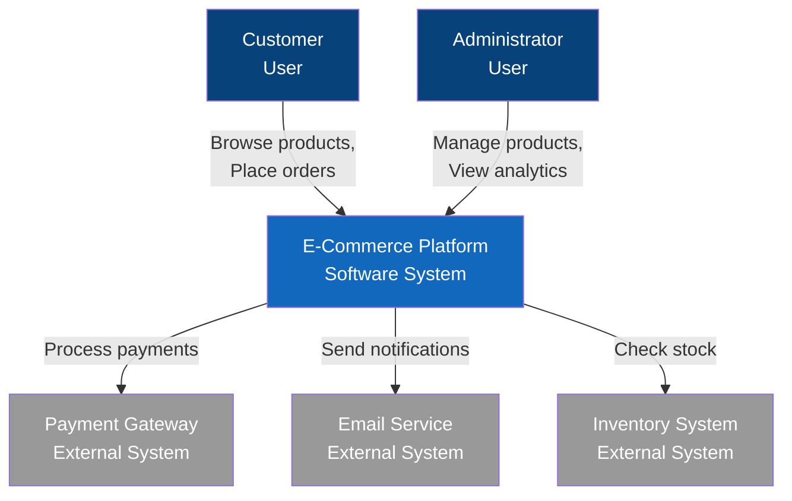

### Best Practices
- Keep to 5-9 boxes (cognitive limit)
- Use clear, business-friendly names
- Show direction of information flow
- Include brief descriptions
- Use consistent coloring:
  - Your system: Blue
  - Users: Dark blue
  - External systems: Gray

---

## Level 2: Container Diagram

### Purpose
Show the high-level technology choices and how containers communicate.

### Audience
- Development team
- DevOps/SRE
- Technical architects
- Tech leads

### What to Include
- ✅ Applications (web apps, APIs, mobile apps)
- ✅ Databases
- ✅ File systems
- ✅ Message brokers
- ✅ Technology stack (in labels)
- ✅ Communication protocols

### What to Exclude
- ❌ Internal code structure
- ❌ Detailed data models
- ❌ Deployment infrastructure

### Example: E-Commerce Container Diagram

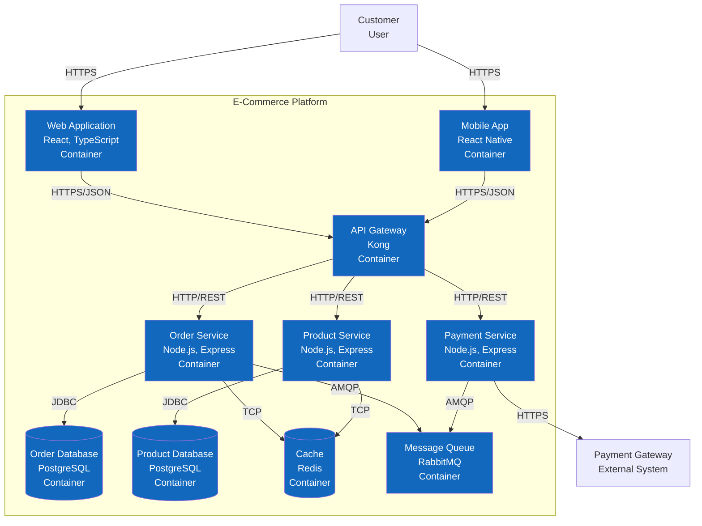

### Best Practices
- Show technology stack in labels (e.g., "Node.js, Express")
- Include communication protocols (HTTP, gRPC, AMQP)
- Group related containers visually
- Limit to 10-15 containers per diagram
- Use database cylinder notation
- Show data stores separately from applications

### Container Types
- **Web Application**: Browser-based UI
- **Mobile App**: Native or hybrid mobile
- **API**: RESTful or GraphQL service
- **Background Worker**: Async job processor
- **Database**: Data storage
- **Cache**: In-memory data store
- **Message Broker**: Event/message queue

---

## Level 3: Component Diagram

### Purpose
Show the internal structure of a single container and how components interact.

### Audience
- Developers working on the container
- Code reviewers
- New team members

### What to Include
- ✅ Major components/modules
- ✅ Responsibilities
- ✅ Interfaces/APIs
- ✅ Dependencies between components

### What to Exclude
- ❌ Individual classes (use Level 4 for that)
- ❌ Implementation details
- ❌ Other containers (reference only)

### Example: Order Service Components

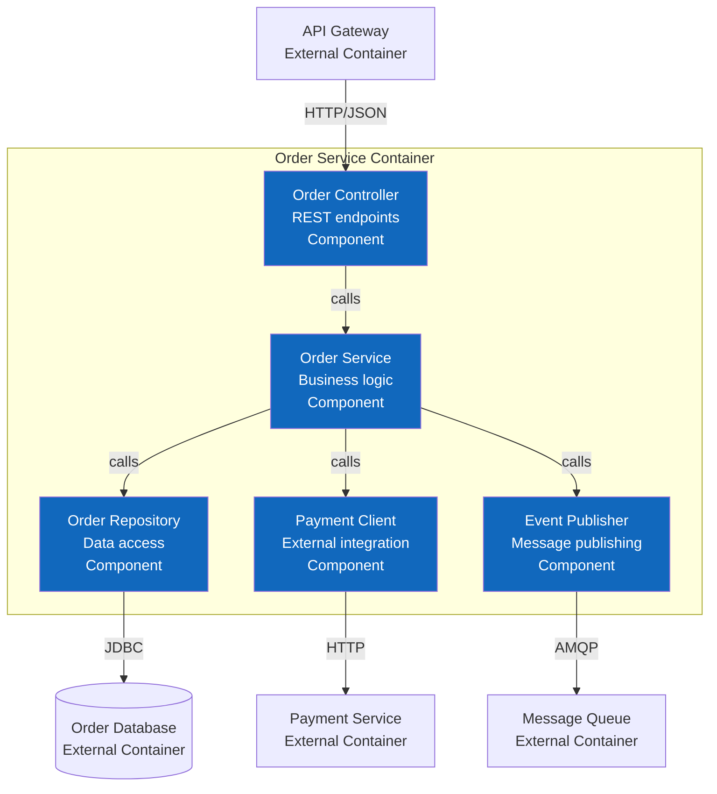

### Best Practices
- Focus on one container at a time
- Show component responsibilities
- Indicate architectural patterns (MVC, Hexagonal, etc.)
- Limit to 8-12 components
- Group by layer or responsibility
- Show external dependencies clearly

### Common Component Patterns

#### Layered Architecture
```
Presentation Layer → Service Layer → Data Layer
```

#### Hexagonal Architecture
```
Adapters (Primary) → Domain → Adapters (Secondary)
```

#### Clean Architecture
```
Controllers → Use Cases → Entities
```

---

## Level 4: Code Diagram (Optional)

### Purpose
Class/interface level details (usually auto-generated).

### Audience
- Developers only

### Tools
- UML class diagrams (PlantUML)
- Auto-generated from code (Doxygen, JavaDoc)

### When to Create
- Complex domain models
- Framework design
- Library APIs

**Recommendation**: Auto-generate these rather than maintaining manually.

---

## Sequence Diagrams

### Purpose
Show how components/containers interact over time for specific scenarios.

### When to Use
- API flows
- Authentication flows
- Error scenarios
- Complex multi-step processes

### Example: Order Placement Flow

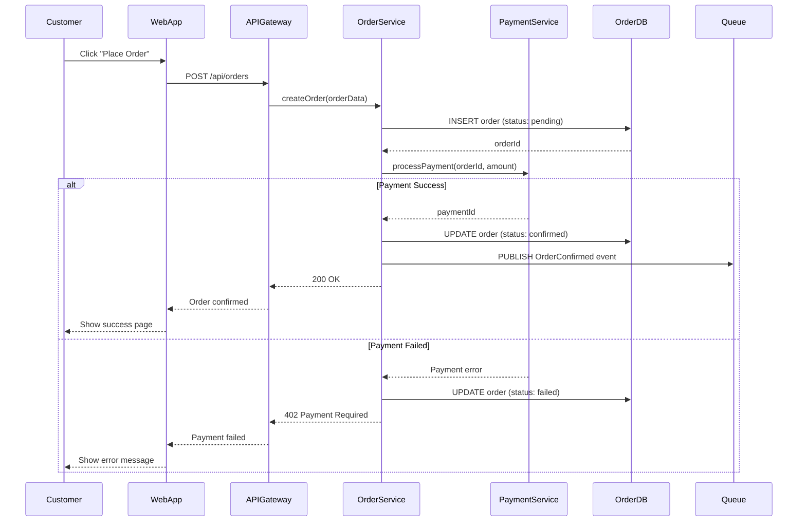

### Best Practices
- Focus on one scenario per diagram
- Include happy path and key error paths
- Show async operations clearly
- Label arrows with method/message names
- Include HTTP status codes for API calls
- Use `alt`/`opt` blocks for conditionals
- Keep participants to 5-8

---

## Data Flow Diagrams

### Purpose
Show how data moves through the system.

### When to Use
- ETL pipelines
- Event-driven architectures
- Data processing workflows
- Integration patterns

### Example: Analytics Pipeline

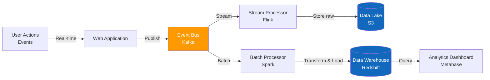

---

## Deployment Diagrams

### Purpose
Show how containers are deployed to infrastructure.

### When to Use
- Infrastructure planning
- DevOps documentation
- Scaling strategies
- Disaster recovery planning

### Example: Kubernetes Deployment

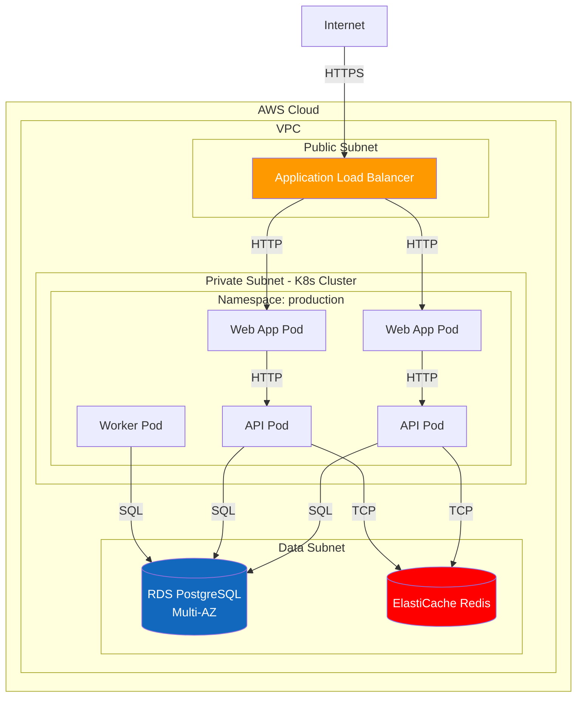

### Best Practices
- Show availability zones for HA
- Include load balancers
- Show data stores separately
- Indicate network boundaries (VPC, subnets)
- Label instance types/sizes
- Show scaling strategy (min/max pods)

---

## Integration Patterns Diagrams

### Common Patterns

#### API Gateway Pattern
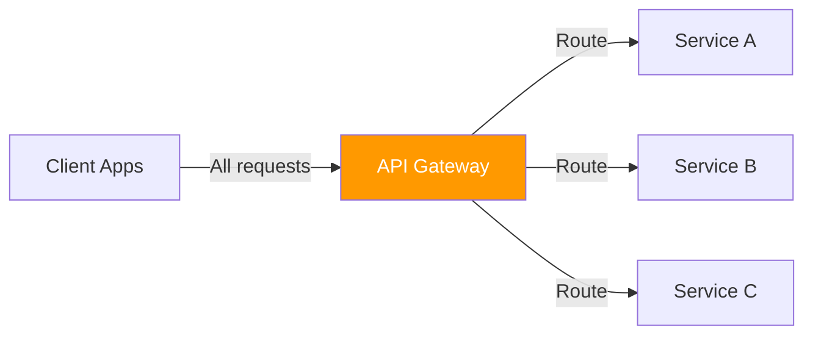

#### Event-Driven Pattern
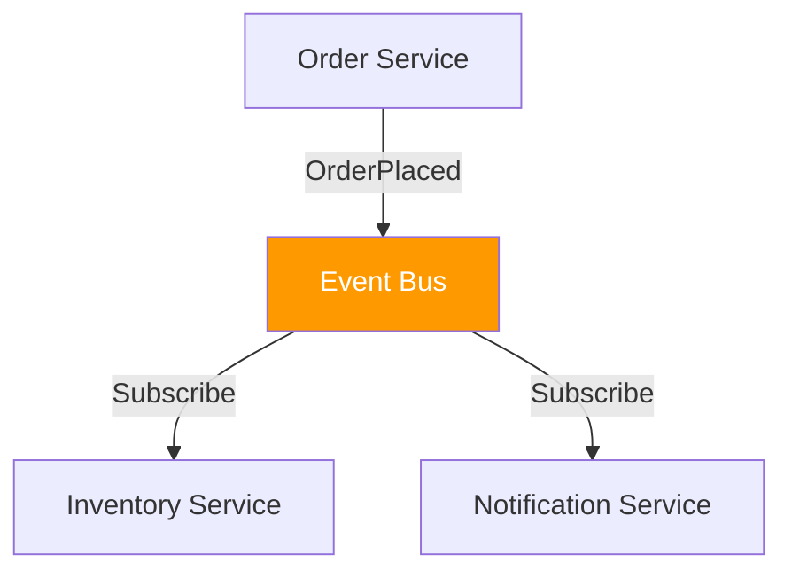

#### Saga Pattern (Orchestration)
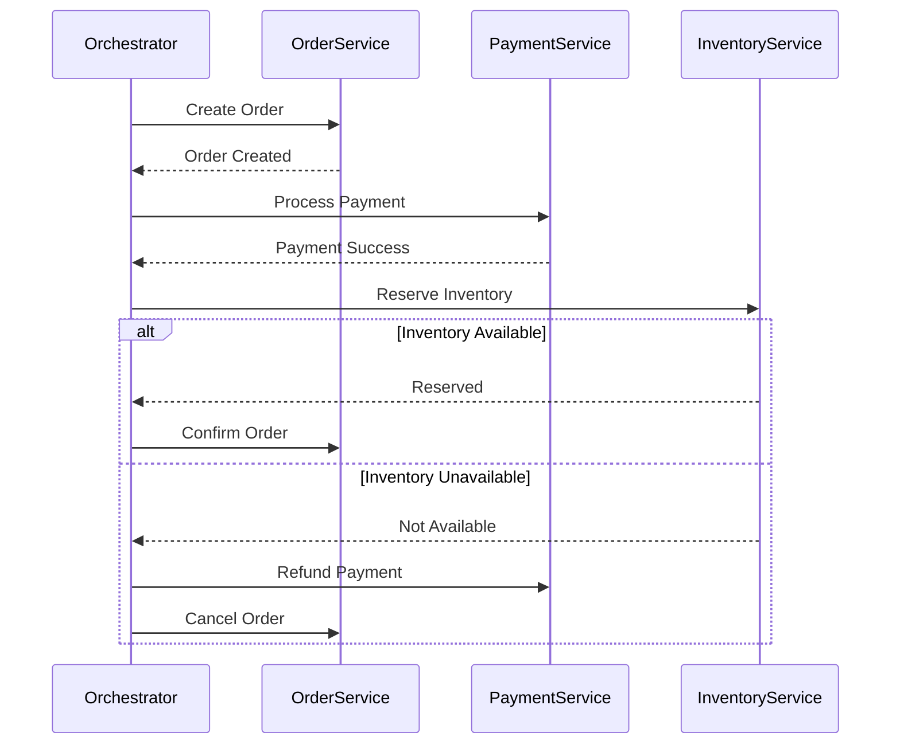

---

## Diagram Styling Guidelines

### Color Scheme

```
System/Container (Internal): #1168bd (Blue)
User/Person: #08427b (Dark Blue)
External System: #999999 (Gray)
Database: #1168bd (Blue) with cylinder shape
Message Queue: #ff9900 (Orange)
Cache: #ff0000 (Red)
Important/Critical: #ff0000 (Red)
```

### Font and Labels

```
Component Name: Bold
Component Type: Italic or in parentheses
Technology Stack: Small text below name

Example:
Order Service
(Node.js, Express)
REST API
```

### Arrow Styles

- Solid arrow: Synchronous call
- Dashed arrow: Asynchronous message
- Bidirectional: Request/response
- Label arrows with protocol (HTTP, gRPC, AMQP)

### Box Styles

- Rectangle: Service/Component
- Cylinder: Database
- Hexagon: External system
- Actor/Person icon: User
- Cloud: External cloud service

---

## Mermaid Syntax Reference

### Basic Graph
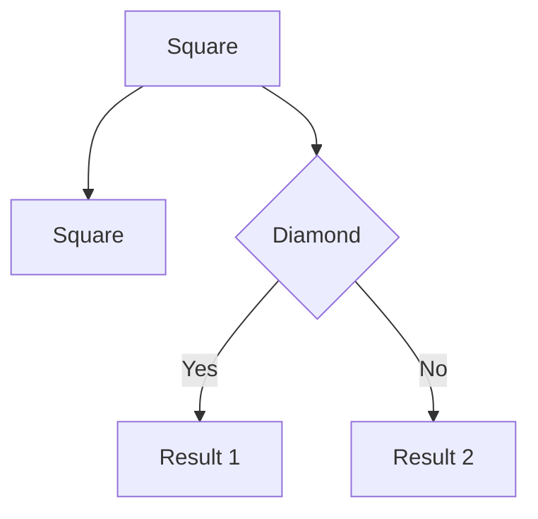

### Sequence Diagram
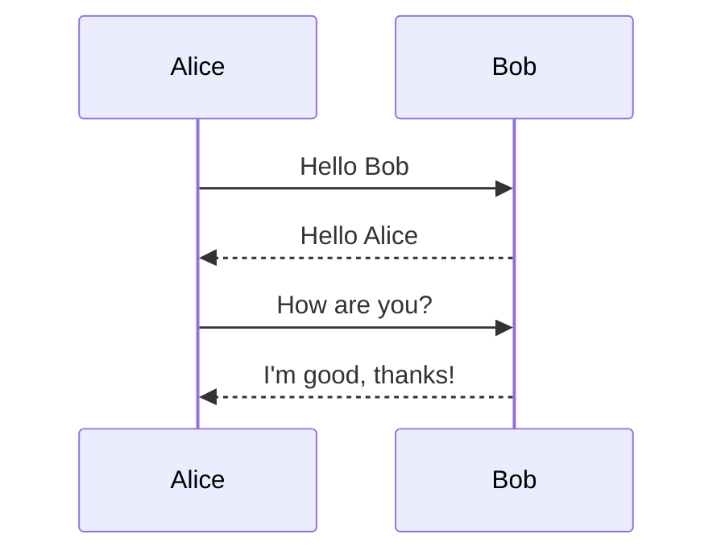

### Class Diagram
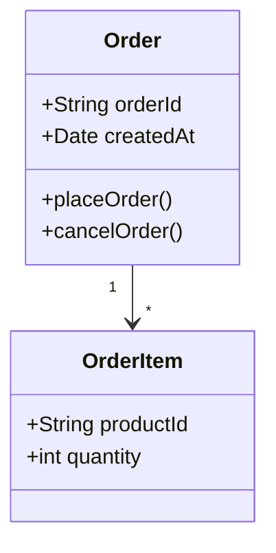

### State Diagram
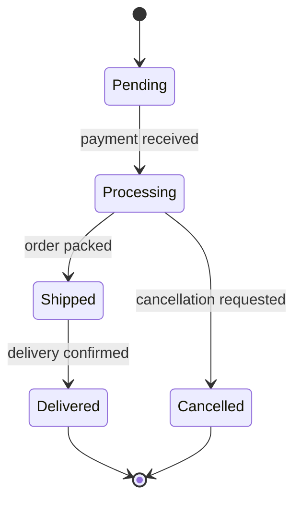

### Entity-Relationship Diagram
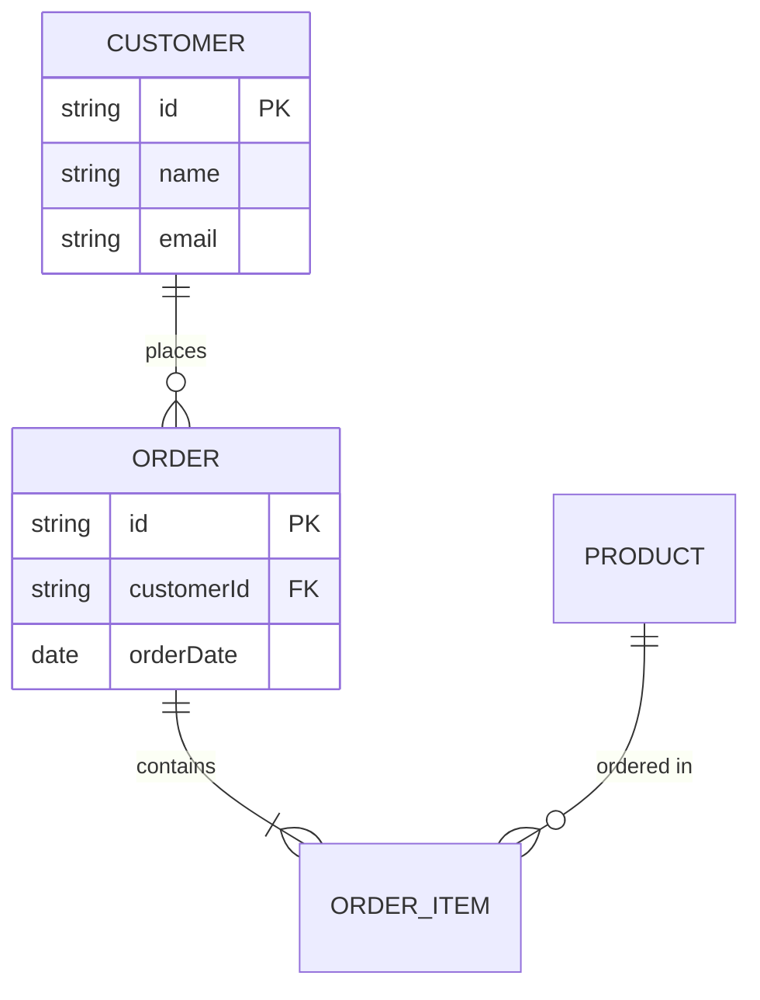

---

## Diagram Best Practices

### Do's
- ✅ Use consistent notation across all diagrams
- ✅ Include a legend if using custom symbols
- ✅ Keep diagrams simple (5-9 boxes ideal)
- ✅ Use descriptive names (not technical IDs)
- ✅ Show protocols on arrows
- ✅ Version your diagrams
- ✅ Store diagrams as code (Mermaid in Markdown)
- ✅ Update diagrams with code changes
- ✅ Include diagrams in code reviews
- ✅ Link diagrams to ADRs

### Don'ts
- ❌ Don't cram too much into one diagram
- ❌ Don't use proprietary tools (prefer open formats)
- ❌ Don't create diagrams that duplicate each other
- ❌ Don't include implementation details in high-level diagrams
- ❌ Don't use cryptic abbreviations
- ❌ Don't let diagrams become stale
- ❌ Don't use screenshots (use text-based formats)
- ❌ Don't create diagrams that can't be version controlled

---

## Diagram Review Checklist

Before finalizing a diagram, check:

- [ ] Purpose is clear (what does this show?)
- [ ] Audience is appropriate (who is this for?)
- [ ] Abstraction level is correct (not too detailed/too high)
- [ ] All boxes are labeled clearly
- [ ] Arrows show direction and are labeled
- [ ] Technology stack is indicated (where relevant)
- [ ] Color coding is consistent
- [ ] Diagram fits on one page/screen
- [ ] Legend included (if custom notation)
- [ ] Date and version on diagram
- [ ] Source file is in version control
- [ ] Linked from relevant documentation

---

## Tool Recommendations

### Text-Based (Preferred)
- **Mermaid**: In Markdown, GitHub/GitLab support
- **PlantUML**: More features, steeper learning curve
- **Structurizr**: C4 Model native, DSL-based

### Visual (Secondary)
- **Draw.io**: Free, good for quick sketches
- **Lucidchart**: Collaboration features
- **Excalidraw**: Hand-drawn style

### Auto-Generated
- **Structurizr**: From code
- **PlantUML**: From code annotations
- **Dependency diagrams**: From build tools

---

## Maintenance Strategy

### Version Control
```
docs/
  architecture/
    diagrams/
      context/
        system-context-v1.0.md
        system-context-v2.0.md (current)
      containers/
        containers-v3.0.md (current)
      components/
        order-service-components-v1.5.md (current)
```

### Review Schedule
- **Context diagrams**: Quarterly or on major changes
- **Container diagrams**: Monthly or on new services
- **Component diagrams**: Sprint basis
- **Sequence diagrams**: As needed for new flows

### Change Process
1. Identify needed change
2. Update diagram source
3. Create PR with diagram changes
4. Review with team
5. Merge and update documentation
6. Communicate changes (Slack, email)

---

## Example: Complete Set for E-Commerce

### 1. Context Diagram
High-level system boundaries (shown earlier)

### 2. Container Diagram
Services, databases, queues (shown earlier)

### 3. Component Diagram - Order Service
Internal structure (shown earlier)

### 4. Sequence Diagram - Checkout Flow
Step-by-step interaction (shown earlier)

### 5. Deployment Diagram
Infrastructure and scaling (shown earlier)

### 6. Data Flow Diagram
Event processing pipeline

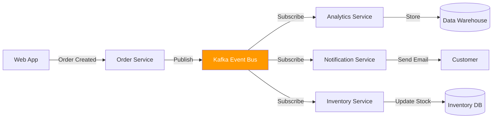

---

## Common Mistakes to Avoid

### 1. Technology Proliferation
**Problem**: Showing every library and framework
**Solution**: Show only significant technology choices

### 2. Wrong Abstraction Level
**Problem**: Mixing levels (e.g., classes in a container diagram)
**Solution**: Stick to one level per diagram

### 3. Spaghetti Diagrams
**Problem**: Too many arrows crossing each other
**Solution**: Reorganize layout, split into multiple diagrams

### 4. Stale Diagrams
**Problem**: Diagrams don't match reality
**Solution**: Include diagram updates in code review, automate where possible

### 5. No Legend
**Problem**: Custom symbols without explanation
**Solution**: Always include a legend for non-standard notation

---

## Template Checklist

When creating a new diagram:

- [ ] Choose appropriate C4 level
- [ ] Identify target audience
- [ ] List elements to include
- [ ] Choose tool (Mermaid preferred)
- [ ] Create first draft
- [ ] Review with team
- [ ] Add to documentation
- [ ] Link from relevant docs
- [ ] Version in Git
- [ ] Schedule review date

---

## Additional Resources

### C4 Model
- Website: c4model.com
- Examples: github.com/structurizr/examples

### Mermaid
- Documentation: mermaid.js.org
- Live editor: mermaid.live

### Best Practices
- "Documenting Software Architectures" - Bass et al.
- "Software Systems Architecture" - Rozanski & Woods
- "The Art of Scalability" - Abbott & Fisher

---

**Last Updated**: 2025-02-11  
**Version**: 2.0  
**Maintained By**: Architecture Team